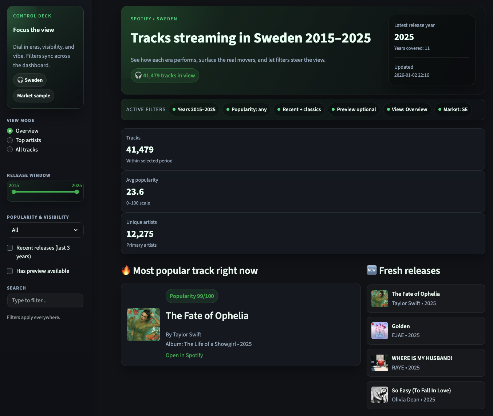
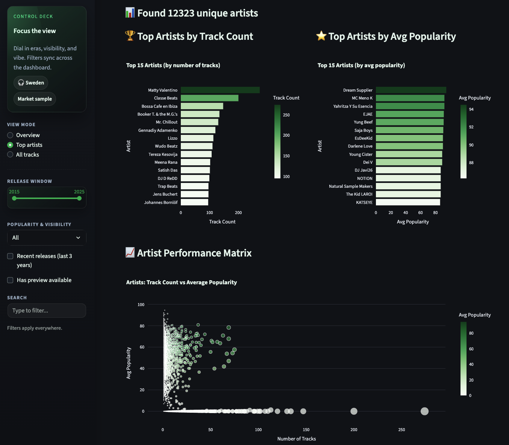
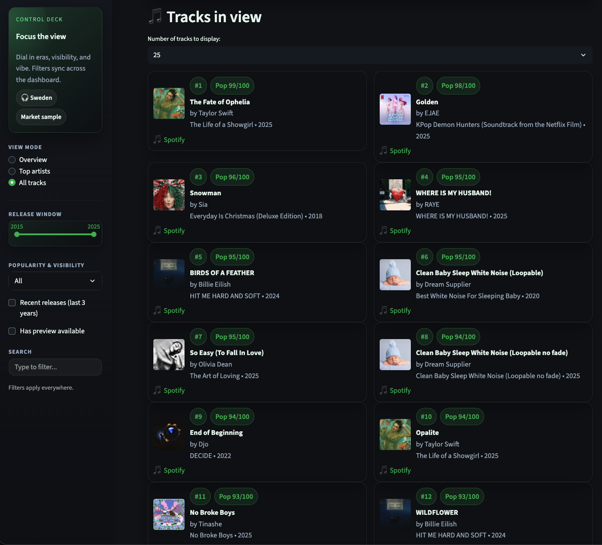
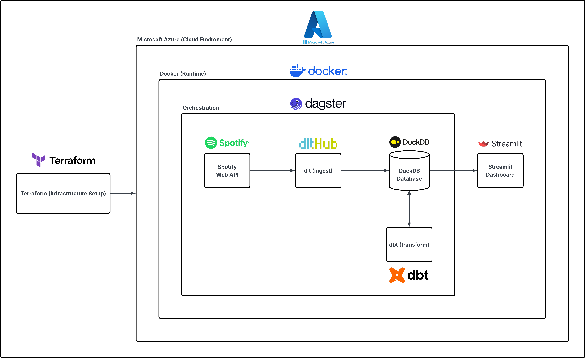

# Spotify Data Platform (Azure)

End-to-end pipeline for Spotify analytics. Spotipy + DLT fetch data, Dagster runs the jobs, dbt builds tables in DuckDB, and Streamlit shows the dashboard. Everything runs in containers and can be deployed to Azure with Terraform.

## Project overview
This repo shows a full data platform from API to dashboard. It is meant to be simple, clear, and repeatable. You can run it locally or deploy it to Azure.

## Dashboard screenshots







## Architecture diagram


## Data flow
1) Fetch Spotify data with Spotipy + DLT and store it in DuckDB.
2) Use dbt to clean and shape the tables.
3) Streamlit reads the tables for the dashboard.
4) Dagster runs and schedules the jobs.

## Azure architecture
- **ACR** stores the Docker images.
- **ACI** runs the Dagster pipeline container.
- **Azure Files** stores the DuckDB file and dbt profiles and mounts them into both services.
- **Azure Web App** runs the Streamlit dashboard container.

## What's inside
- **Extraction**: Spotipy + DLT fetch tracks and artists and store them in DuckDB.
- **Orchestration**: Dagster runs the jobs and provides the Dagster UI.
- **Transform**: dbt builds clean tables in DuckDB.
- **Serve**: The Streamlit dashboard reads from `/mnt/data/spotify.duckdb`.
- **Infra as Code**: Terraform creates the Azure resources and builds/pushes the Docker images.

## Prerequisites
- Docker Desktop (buildx enabled, logged in).
- Python 3.11+ for local tooling.
- Azure CLI (`az login`).
- Terraform CLI.
- Spotify API creds available as environment variables:
  - `SPOTIPY_CLIENT_ID`, `SPOTIPY_CLIENT_SECRET`, `SPOTIPY_REDIRECT_URI`

## Local quickstart
1) Create a `.env` in the repo root (KEY=VALUE):
```
SPOTIPY_CLIENT_ID=...
SPOTIPY_CLIENT_SECRET=...
SPOTIPY_REDIRECT_URI=https://localhost:8501
```
2) (Optional) Run with Docker Compose:
```
docker-compose up --build
```
Dagster UI: localhost:3000, Streamlit: localhost:8501, DuckDB file: `./mnt/data/spotify.duckdb`.

## Deploy to Azure with Terraform
From `iac/`:
1) Create `iac/terraform.tfvars` (gitignored) with the required values:
```
spotipy_client_id     = "..."
spotipy_client_secret = "..."
subscription_id       = "..."            # avoid the wrong subscription
location              = "swedencentral"  # changing region replaces resources
prefix_app_name       = "spotifyproject" # optional
is_windows            = false            # set true on Windows to use bash.exe for local-exec
```
2) Initialize and apply:
```
terraform init
terraform plan
terraform apply
```

If you keep secrets in `.env`, export them and use TF_VAR:
```
set -a
source ../.env   # exports SPOTIPY_* locally
set +a
TF_VAR_spotipy_client_id="$SPOTIPY_CLIENT_ID" \
TF_VAR_spotipy_client_secret="$SPOTIPY_CLIENT_SECRET" \
terraform apply
```

What apply does:
- Builds and pushes two images to ACR (`spotifyprojectcr<rand>.azurecr.io`): `spotifyproject-pipeline` and `spotifyproject-dashboard`.
- Creates an Azure Files share and mounts it to `/mnt/data` in both containers.
- Starts Dagster in ACI and the Streamlit app in Azure Web App.

Outputs to note after apply:
- `dagster_url` - Dagster UI for running/monitoring jobs
- `dashboard_url` - Streamlit app
- `pipeline_container_group_name` - ACI name for troubleshooting

## Dagster usage
- Open `dagster_url` and enable the two automations: `ingest_spotify_schedule` and `trigger_dbt_after_ingest`.
- Run `load_spotify_to_duckdb` once.
- After that, the rest should run automatically.

## Project layout
- `dockerfile.dwh` - Docker image for Dagster/DLT/dbt
- `dockerfile.dashboard` - Docker image for Streamlit
- `data_extract_load/` - Spotify ingestion code
- `dbt_spotify_duckdb/` - dbt models
- `orchestration/` - Dagster definitions and assets
- `dashboard/` - Streamlit app and data connector
- `iac/` - Terraform definitions

## Operating notes
- DuckDB path is fixed to `/mnt/data/spotify.duckdb` (backed by Azure Files).
- Spotipy credentials are passed via Terraform `TF_VAR_spotipy_*` and are not stored in code or images.
- If you change code, run `terraform apply` again to rebuild the images.
- Make sure Docker Desktop is running before `terraform apply` (buildx step).
